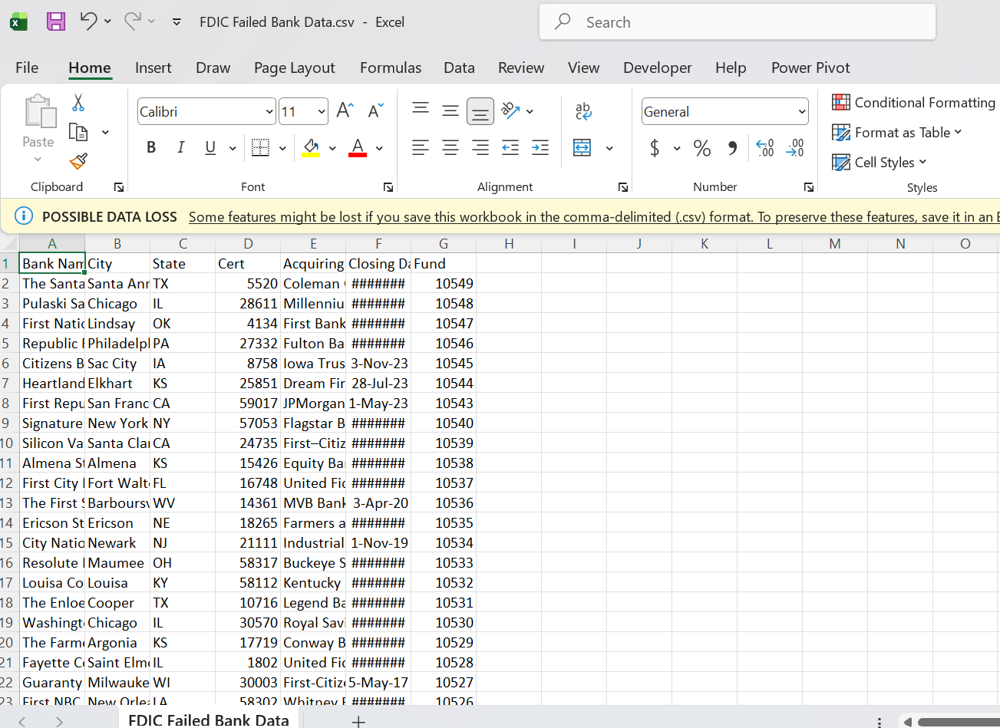
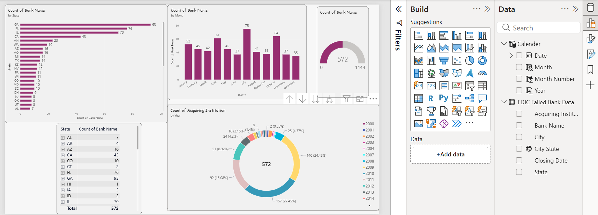

# Failed Bank Analysis | Power BI

An interactive Power BI report exploring U.S. bank failures using publicly available data from the Federal Deposit Insurance Corporation (FDIC).

The report helps users examine where and when bank failures occurred and compare results across states and years.

## Before and After

### Before: Source Data



### After: Power BI Report


## Project Overview:
# Business Context and STAR Summary

### Situation
Bank failures are recorded in public data, but the raw list can be difficult to explore quickly by location and time. Stakeholders may need a clearer way to review patterns in the available records.

### Task
I built an interactive Power BI report to organize FDIC failed-bank data and make it easier to examine failures by state, city, and date.

### Action
- Connected Power BI to the FDIC Failed Bank List.
- Cleaned and prepared the data in Power Query.
- Created a combined city-and-state field to make locations easier to distinguish.
- Created a calendar table for date-based analysis.
- Built report visuals, including a matrix that lets users drill from state to city.
- Added interactive filtering so users can explore the data by selecting report visuals.

### Result
The project delivers an interactive report for exploring the failed-bank records by location and time. Users can review summarized counts, drill into state and city details, and filter the report to investigate patterns in the available data.

> This project describes patterns in historical records. It does not predict future bank failures or establish their causes.

## Tools and Skills

- Power BI Desktop
- Power Query
- DAX
- Data cleaning and transformation
- Data modeling
- Report design and data visualization

## Data Source

The report uses the FDIC’s public **Failed Bank List**.

- Source: [FDIC Failed Bank List](https://www.fdic.gov/resources/resolutions/bank-failures/failed-bank-list/)
- Data provider: Federal Deposit Insurance Corporation (FDIC)

The FDIC may update its data over time. Report results can change when the source data changes.

## Report Features

- Bank failure counts by state
- Date-based analysis using a calendar table
- Interactive visuals and filtering
- A combined city-and-state field to distinguish locations with the same city name

> Update this section to match the visuals and features in your finished report.

## Repository Structure

```text
.
├── images/
│   ├── before-source-data.png
    └── after-power-bi-report.png
├── Failed Bank-Power BI
    ├── Failed-Bank-Analysis.pbix
    └── Failed-Bank-Data-CVS.pbix
└── README.md
```
##  Notes

Power BI Desktop is needed to open the .pbix file.

The report connects to a public web data source, so access or refresh may depend on your network settings.

This project is for learning and analysis. It should not be treated as financial advice.

## Acknowledgments
This project was created as a learning exercise based on the Power BI Beginner to Pro tutorial by Pragmatic Works.

## Author
[AILA IMAN]
